<section id="one">
	

		<header class="major">
			<h1>Paintings</h1>
		</header>

<section id="one">
	      

		          <header class="major">
			                <h3>Oil Painting</h3>
		          </header>
              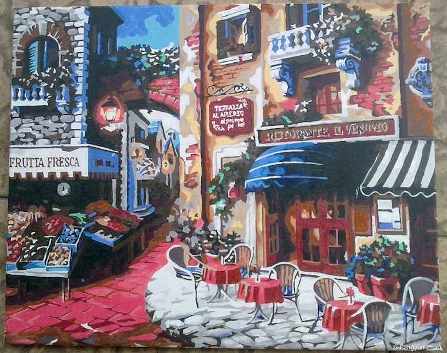
              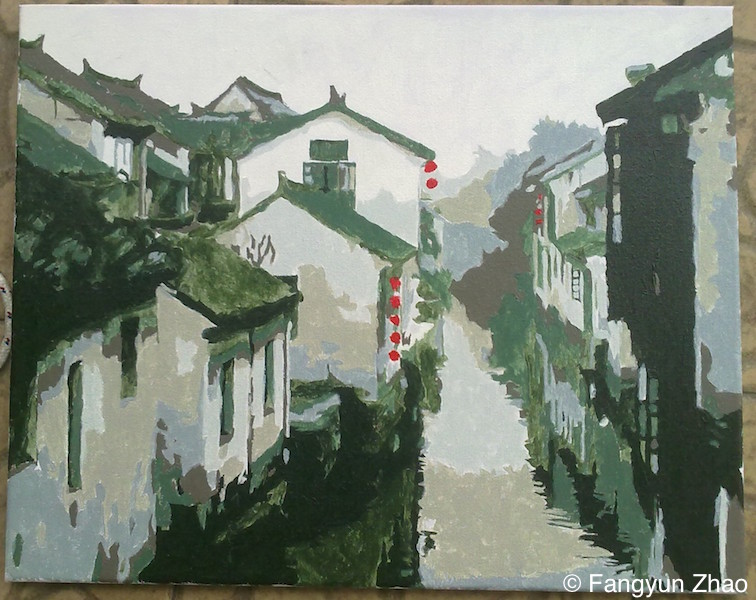
	      

</section>

<section id="two" class = "spotlights">
	      

		          <header class="major">
			                <h3>Traditional Chinese Painting</h3>
		          </header>
              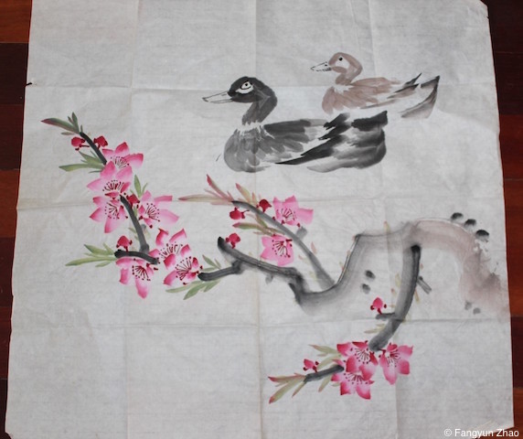
              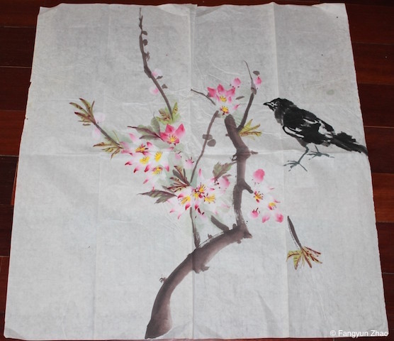
              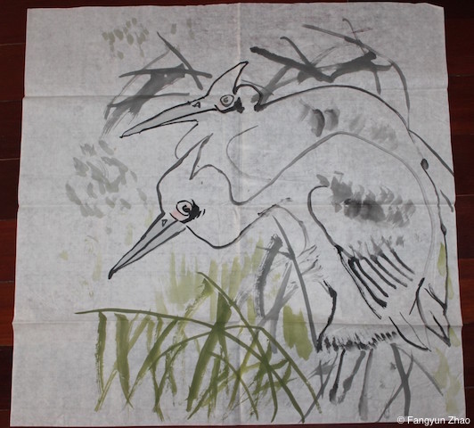
              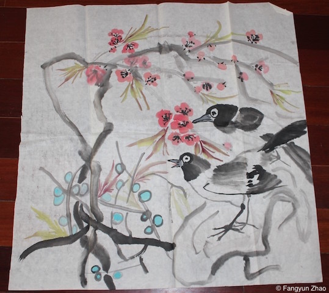
              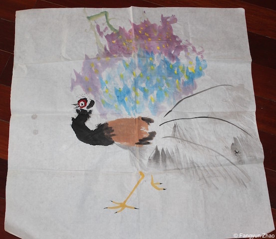
              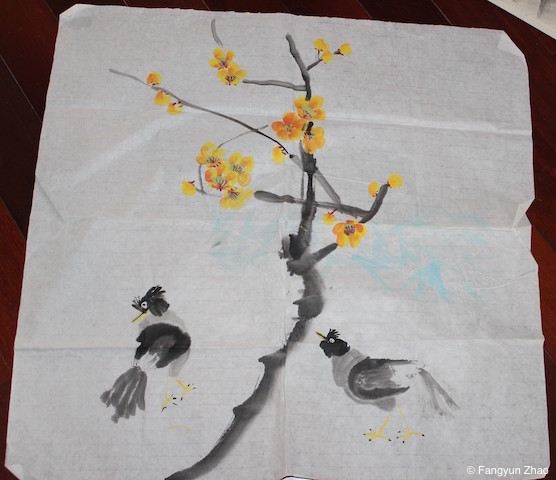
              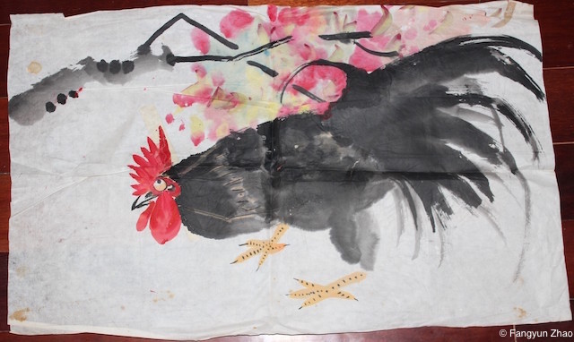
	      

</section>

<section id="three">
	      

		          <header class="major">
			                <h3>Pencil Sketching</h3>
		          </header>
              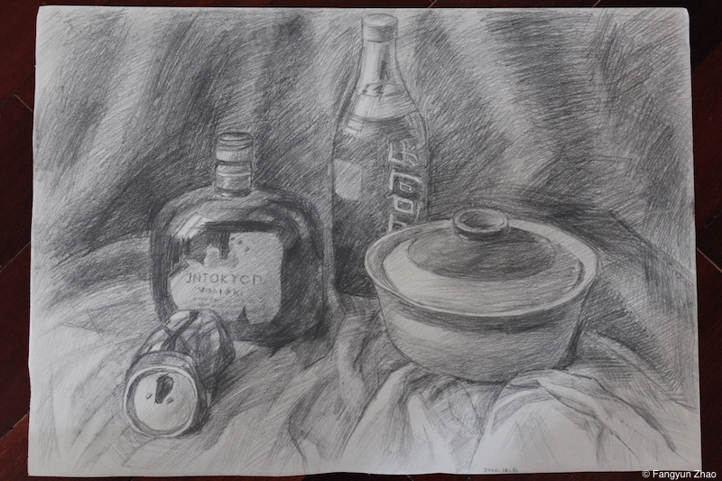
              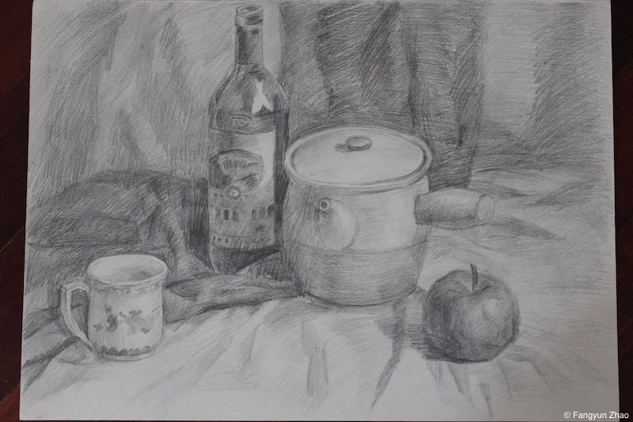
              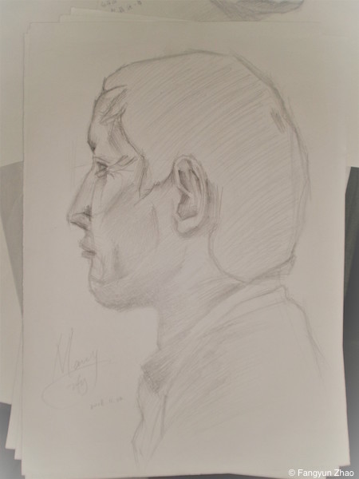
	      

</section>

<section id="two">
	 This work by Fangyun Zhao is licensed under a <a rel="license" href="http://creativecommons.org/licenses/by-nc-nd/4.0/">Creative Commons Attribution-NonCommercial-NoDerivatives 4.0 International License</a>.
	</section>
