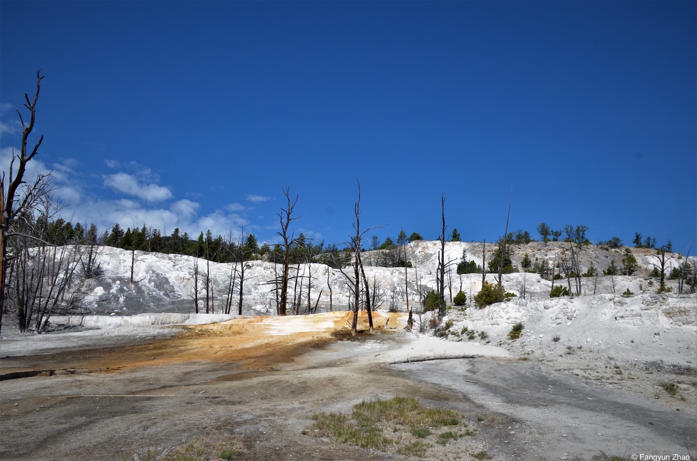

<section id="one">
	

		<header class="major">
			<h1>Photo Gallery</h1>
		</header>

<h3>Aurora Borealis, Alaska, April 2015</h3>

<h3>Lake Mendota, Madison, Summer 2016</h3>

<h3>Yellowstone National Park, July 2016</h3>

<h3>Bloody Moon, Madison, September 2015</h3>

<h3>More</h3>

 

 This work by Fangyun Zhao is licensed under a <a rel="license" href="http://creativecommons.org/licenses/by-nc-nd/4.0/">Creative Commons Attribution-NonCommercial-NoDerivatives 4.0 International License</a>.
